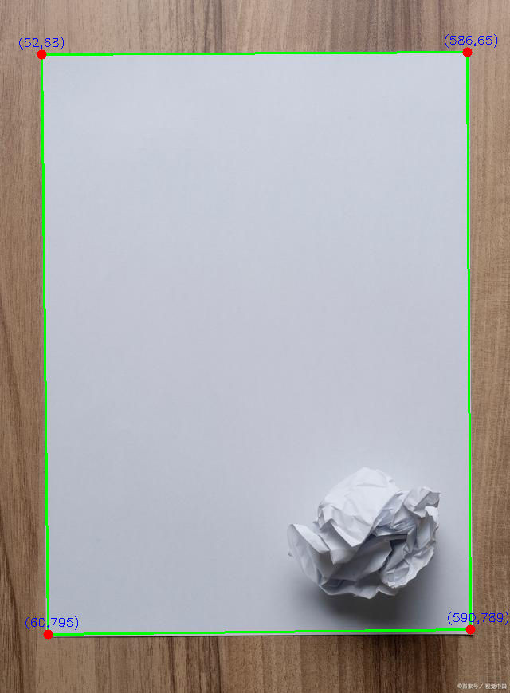
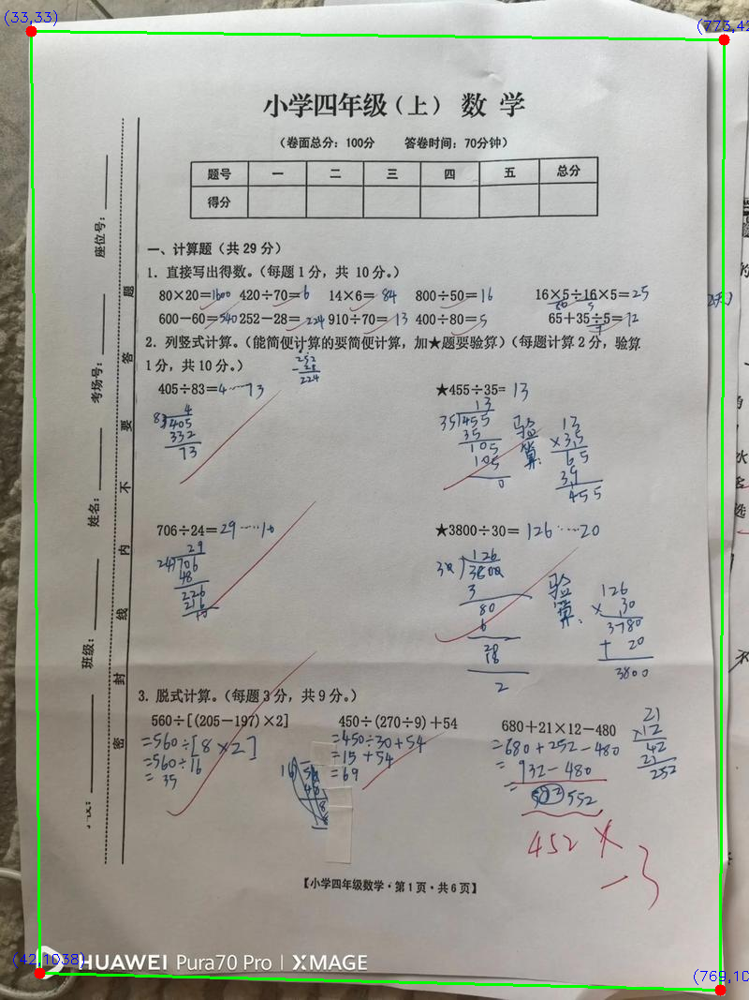
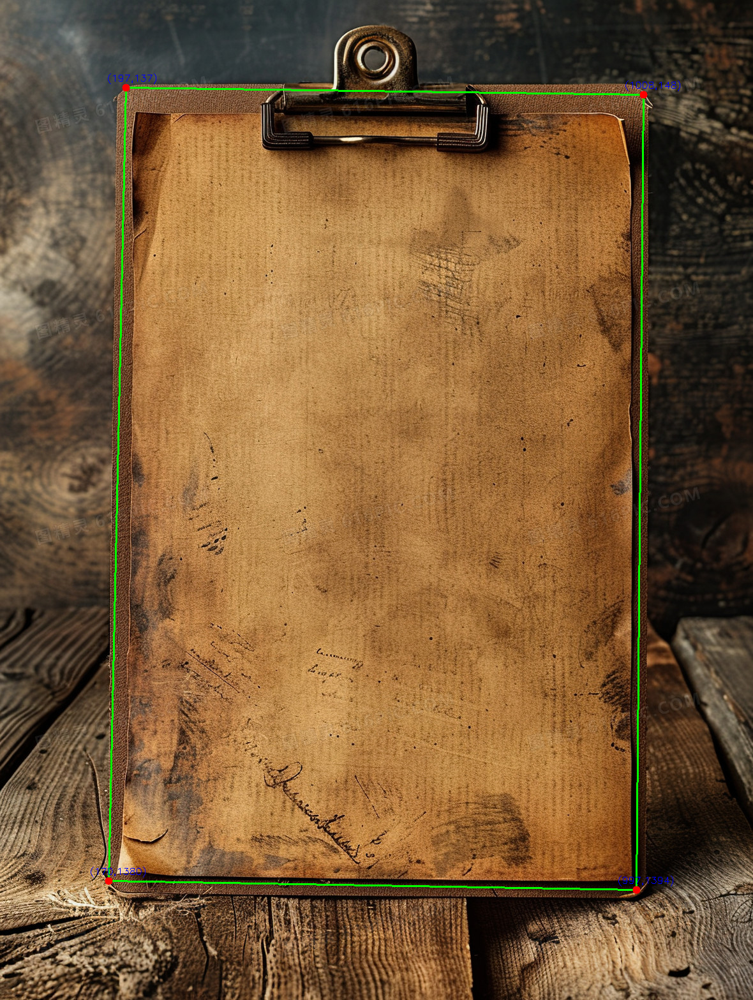
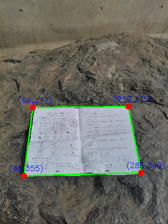
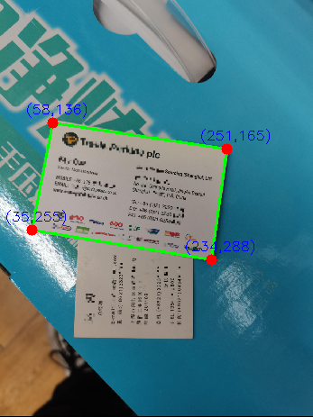
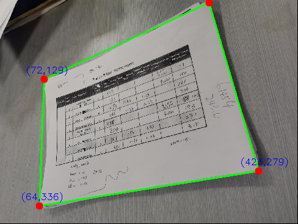

# 纸张边缘检测算法
技术路线选型：SAM＋canny边缘检测算法+OpenCV 轮廓检测与角点筛选 
## 运行环境
python 版本：3.12.12

操作系统：windows11

GPU：RTX-3050（4GB显存）

## 项目文件结构介绍
#### src目录
核心算法模块（SAM + Canny + 轮廓与角点筛选）
#### scripts目录
可运行脚本入口（批量/单张处理）
#### data目录
推荐放置输入图片（例如 data/test-images）
#### models目录
推荐放置模型权重（例如 models/sam）
#### outputs目录
默认输出结果目录（例如 outputs/sam_canny）
#### experiments目录
历史调研代码与实验记录
#### legacy目录（兼容保留）
history_code / sam_weights / test 为旧目录，仍可被脚本自动识别


## Quick start：

#### 1.拉取项目包
```
  git clone https://github.com/helloGitHub-art/documentDivision.git
```
    
#### 2.创建隔离环境
```
  python -m venv myVenv
```
    
#### 3.激活环境
```
  myVenv/scripts/activate
```

#### 4.安装 torch（先选 CPU 或 GPU 版本）
CPU 版（无显卡/不需要 GPU）：
```
  pip install torch torchvision torchaudio --index-url https://download.pytorch.org/whl/cpu
```
GPU 版（NVIDIA 显卡，CUDA 12.x）：
```
  pip install torch torchvision torchaudio --index-url https://download.pytorch.org/whl/cu121
```
#### 5.安装其余依赖
```
  pip install -r requirements.txt
```

#### 6.准备输入与权重
默认会优先读取：
- 输入目录：`data/test-images`（如不存在会回退到 `test/test-image`）
- 权重文件：`models/sam/sam_vit_b_01ec64.pth`（如不存在会回退到 `sam_weights/sam_vit_b_01ec64.pth`）

#### 7.运行
```
  python run_batch.py
```
运行入口文件为 `run_batch.py`（批量处理，根目录可直接运行）。
输出结果默认保存在 `outputs/sam_canny` 目录下。

可选参数示例：
```
  python run_batch.py --input-dir data/test-images --output-dir outputs/sam_canny --model-path models/sam/sam_vit_b_01ec64.pth
```

## 结果展示
默认结果在 `outputs/sam_canny`。以下为 legacy 目录 `test/result` 的展示示例：








